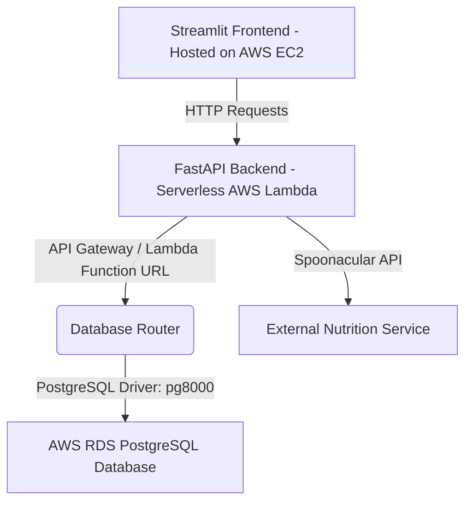

# 🥗 NutriPlan: Food & Nutrition Analyzer & Meal Planner

NutriPlan is a modern, full-stack web application designed to help users set nutritional goals, analyze meal macros, generate personalized meal plans, and track daily caloric/macro-nutrient intake.

---

## 🏛️ System Architecture

NutriPlan is built using a decoupled architecture, optimized for scalability, low maintenance, and cloud-native hosting on AWS:



*   **Frontend:** Built with [Streamlit](https://streamlit.io/) and hosted on an **AWS EC2** instance, utilizing vanilla styling for a clean, user-friendly interface.
*   **Backend:** A serverless [FastAPI](https://fastapi.tiangolo.com/) application deployed to **AWS Lambda** (wrapped via [Mangum](https://mangum.io/)), exposing a clean REST API.
*   **Database:** A cloud-hosted **AWS RDS PostgreSQL** database utilizing **SQLAlchemy ORM** for object-relational mapping.
*   **External APIs:** Integrates with the **Spoonacular API** for real-time, comprehensive food ingredient & recipe analysis.
*   **CI/CD:** Automated via **GitHub Actions** workflows to test, package, and deploy both frontend and backend updates.

### ☁️ AWS Cloud Infrastructure & Services

*   **AWS EC2 (Elastic Compute Cloud):** Hosts the interactive Streamlit user interface, running permanently as a background service using `systemd`.
*   **AWS Lambda (Serverless Compute):** Hosts the FastAPI backend handler. It scales automatically, is billed per execution, and utilizes the **Mangum** adapter to process ASGI requests.
*   **Amazon S3 (Simple Storage Service):** Serves as a deployment staging bucket (`s3://nutriplan-deployment`). During the GitHub Actions pipeline, the packaged zip file containing dependencies, backend files, and seed datasets is uploaded here first. AWS Lambda is then instructed to pull the updated function code directly from this bucket. This bypasses the AWS Lambda direct-upload size limit (50MB) and ensures smooth automated deployments.
*   **AWS RDS PostgreSQL (Relational Database Service):** A fully-managed PostgreSQL database storing user profiles, goals, history logs, and meal plan records. It interfaces with the backend via the lightweight, pure-Python `pg8000` driver.

---


## 🚀 Key Features

1.  **Dashboard & Profiles:** Set daily health goals (Calories, Protein, Carbs, Fats) and customize user profiles.
2.  **Nutrition Analyzer:** Analyze any custom meal or food item in real-time, pulling detailed macro and micro-nutrients using the Spoonacular API.
3.  **Meal Planner:** Suggests curated Breakfast, Lunch, and Dinner options tailored to specific dietary preferences (e.g., vegetarian, high-protein).
4.  **Daily Calorie Tracker:** Log meals throughout the day and watch progress rings fill up against your daily target macros.
5.  **History Logs:** Visually review your historical food logs to monitor dietary habits over time.

---

## 📁 Repository Structure

```text
mealplanner/
├── .github/workflows/          # CI/CD pipelines
│   ├── deploy-backend.yml      # Auto-deploys FastAPI to AWS Lambda via S3
│   └── deploy-frontend.yml     # SSHs into EC2 to pull & restart Streamlit
├── backend/
│   ├── api/                    # API Route endpoints (nutrition, history, etc.)
│   ├── config/                 # Settings and external configuration
│   ├── database/               # SQLAlchemy models and connection setup
│   ├── main.py                 # FastAPI application & Lambda handler entry point
│   └── services/               # Spoonacular client and business logic
├── frontend/
│   ├── components/             # Reusable UI widgets (e.g. sidebar)
│   ├── pages/                  # Streamlit Multi-page structure (1 to 4)
│   ├── app.py                  # Streamlit main entry dashboard page
│   └── config.py               # Configures the active API endpoint
├── foods_dataset.json          # Seeding file for local database foods
├── meal_plans.json             # Seeding file for local database meal plans
├── requirements.txt            # Package dependencies for frontend/local execution
└── requirements-backend.txt    # Minimal package list for AWS Lambda packaging
```

---

## ⚙️ Local Development Setup

### 1. Prerequisites
*   Python 3.10+
*   Spoonacular API Key (Get a free key [here](https://spoonacular.com/food-api))

### 2. Environment Configuration
Create a `.env` file in the root directory:
```env
SPOONACULAR_API_KEY=your_spoonacular_api_key_here
DATABASE_URL=sqlite:///./backend/food_nutrition.db # Defaults to local SQLite
```

### 3. Backend Setup
1. Create and activate a virtual environment:
   ```bash
   python -m venv .venv
   Source .venv/bin/activate  # On Windows: .venv\Scripts\activate
   ```
2. Install dependencies:
   ```bash
   pip install -r requirements.txt
   ```
3. Run the FastAPI development server:
   ```bash
   uvicorn backend.main:app --reload --port 8000
   ```
   *The backend will automatically start up, create database tables, and seed initial foods from `foods_dataset.json`.*

### 4. Frontend Setup
1. In `frontend/config.py`, verify `API_BASE_URL` is set to point to localhost:
   ```python
   API_BASE_URL = "http://localhost:8000"
   ```
2. Start the Streamlit application:
   ```bash
   streamlit run frontend/app.py
   ```
3. Open `http://localhost:8501` in your browser.

---

## ☁️ AWS Production Deployment

### Database (RDS PostgreSQL)
1. Provision a PostgreSQL DB Instance on **AWS RDS**.
2. Make sure your RDS Security Group allows inbound traffic on port `5432` from your Lambda security group and local IP.
3. Update your `.env` (or Lambda environment variables) `DATABASE_URL` using the PostgreSQL syntax:
   ```env
   DATABASE_URL=postgresql+pg8000://<username>:<password>@<rds-endpoint>:5432/<db_name>
   ```

### Backend (AWS Lambda + Function URL/API Gateway)
1. Deploy your FastAPI project to AWS Lambda.
2. In the AWS Lambda Console under **Configuration -> Runtime settings**, set your handler to:
   ```text
   backend.main.handler
   ```
3. Enable a **Lambda Function URL** (with CORS allowed) or configure an **API Gateway** trigger to expose the handler.
4. Paste the resulting HTTPS base URL into `frontend/config.py`:
   ```python
   API_BASE_URL = "https://<your-lambda-url-or-api-gateway>.aws/"
   ```

### Frontend (AWS EC2)
1. Host the frontend folder on an EC2 instance (Amazon Linux 2 or Ubuntu).
2. Configure Streamlit to run permanently as a background service via `systemd`.
3. Set up a reverse proxy (e.g. Nginx) if SSL/Custom domain configuration is desired.

---

## 🤖 CI/CD Deployment Workflows

NutriPlan uses GitHub Actions workflows for continuous deployment on push to the `master` branch:

### Backend Deployment (`deploy-backend.yml`)
When code inside `backend/` or `requirements-backend.txt` is updated:
1. Spins up a Linux container using the appropriate Python version.
2. Packages dependencies from `requirements-backend.txt` to minimize size limits.
3. Zips dependencies along with backend codebase & seed JSONs.
4. Uploads the zip archive to S3 Staging bucket.
5. Updates the AWS Lambda function code pulling directly from S3.

### Frontend Deployment (`deploy-frontend.yml`)
When code inside `frontend/` is updated:
1. Establishes a secure SSH connection to your EC2 instance.
2. Navigates to the workspace directory `/home/ec2-user/NutriPlan`.
3. Performs a `git pull` from your repository.
4. Installs updated packages in the virtual environment.
5. Restarts the system daemon service:
   ```bash
   sudo systemctl restart streamlit
   ```

---

## ⚠️ Project Limitations & Ongoing Efforts

While NutriPlan provides robust food analysis and tracking capabilities, it currently has some limitations:

*   **Spoonacular API & Regional Cuisine:** The external Spoonacular API is primarily optimized for Western ingredients and recipes. Consequently, it may produce inaccurate results or fail to resolve traditional Indian dishes for nutrition analysis and calorie tracking.
*   **Custom Indian Food Support:** To address this, custom Indian food entries have been curated and seeded into the local database. Users can access these regional options directly within the **Meal Planner**.
*   **Database Coverage:** Currently, the meal planner database contains a limited collection of Indian recipes. However, this dataset is designed to be dynamically updated, with plans to consistently add more regional meals over time.

